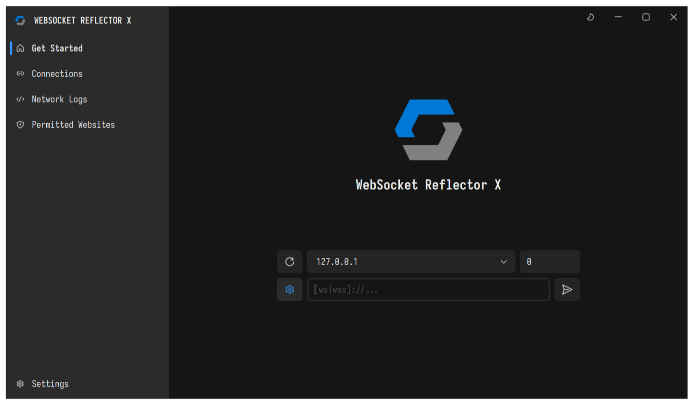
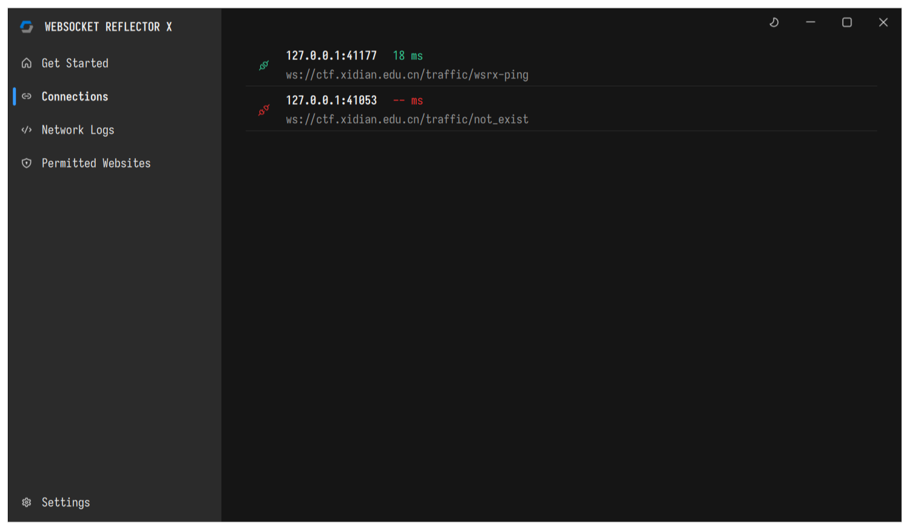
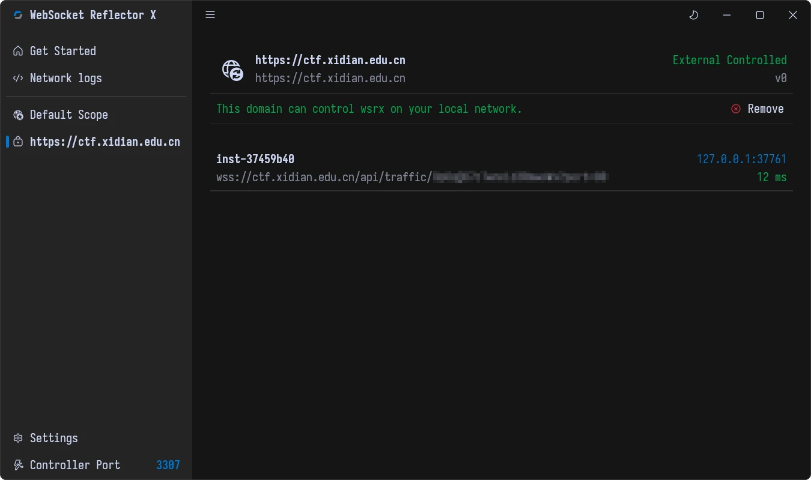
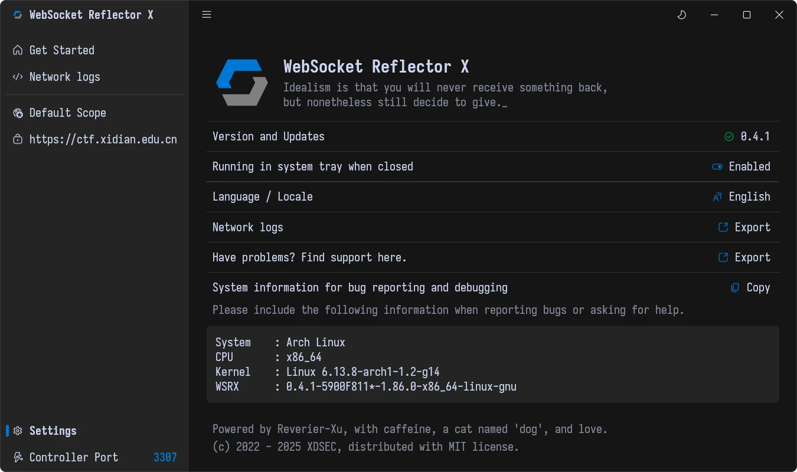

# WebSocket Reflector X

Controlled TCP-over-WebSocket forwarding tunnel.

[Crate Homepage](https://crates.io/crates/wsrx) | [Crate Docs](https://docs.rs/crate/wsrx/latest)

## Usage

Download from [Releases](https://github.com/XDSEC/WebSocketReflectorX/releases) page and run it.

### Desktop App

[#madewithslint](https://slint.dev/showcase.html) !

#### For Mac Users

> [!CAUTION]
> Apple Developer requires a mac and developer account, which I neither have.
>
> so that's required you to do some operations manually before using it, apologize for that.

Run the command before using:

```
sudo xattr -cr ./WebSocketReflectorX-x.x.x-macos-aarch64.dmg
```

### Command Line Tools

This release contains the desktop GUI application and the cli daemon, so it's size may too big for some users.

you can just install the command-line tool from Cargo:

```
cargo install wsrx
```

then you can use `wsrx` directly without desktop application.

## **PRs about GitHub CI for other linux distro are welcome!**

## Development

```bash
cargo build --release --bins
```

and find the binary in `target/release`.

## Further Reading

If you want to intergrate `wsrx` in your own server project, you can read the [crate docs](https://docs.rs/crate/wsrx/latest).

Also, `wsrx` is a simple tool that using plain WebSocket protocol to tunnel TCP connections, so you can implement your own server / client in other languages you like. You can read the [Protocol Docs](docs/PROTOCOL.md) for more information.

## Desktop Preview








